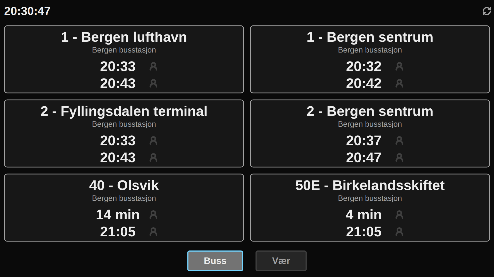
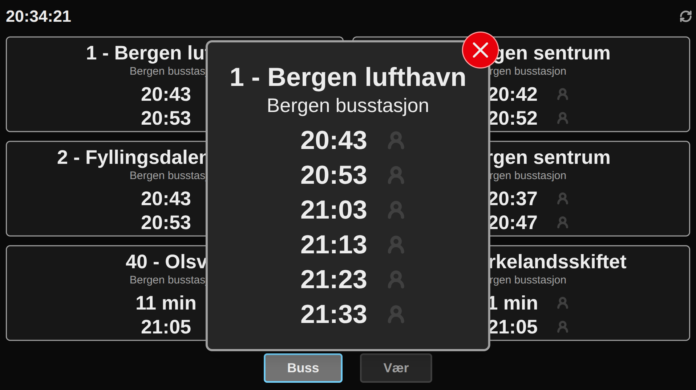
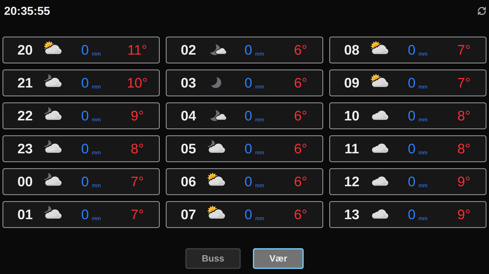

# Pi Display Dashboard
This is a tiny project for displaying bus times and weather on a Raspberry Pi Touch Display 2.
It could possibly be used on other touch displays as well, but the UI is specifically designed for the Raspberry Pi Touch Display 2.
This is made specifically for Vestland in Norway and only supports bus times from Skyss. The UI is made to support up to 6 different bus times at a time.

## Images
### Bus page

### Detailed bus view

### Weather page


## Setup
### Environment
Find your coordinates in some online map and set some form of user agent, like an email.
In .env:
```
YR_LAT=<latitude>
YR_LON=<longitude>
YR_USER_AGENT=<email/other>
```

### Skyss config
The number for the bus stops can be found at [https://reise.skyss.no/](https://reise.skyss.no/). Open developer tools and the network tab. Choose to search for departures, search for the bus stop and locate the correct bus stop in the response for the graphql request. Copy the number from: `"id": "NSR:StopPlace:<number>"`. Multiple bus stops can be added, and if they have overlap in bus routes, the first bus stop in the list will be prioritised.
In skyss-config.json:
```json
{
  "stops": [
    "62356"
  ],
  "routes": [
    {
      "name": "1",
      "inbound": true,
      "outbound": true
    },
    {
      "name": "2",
      "inbound": true,
      "outbound": true
    },
    {
      "name": "40",
      "inbound": false,
      "outbound": true
    },
    {
      "name": "50E",
      "inbound": false,
      "outbound": true
    }
  ]
}

```

## Running
### Run locally
```bash
npm run dev
```

### On Raspberry Pi
With NPM:
```bash
npm run build
npm start
```

With Docker:
```bash
docker compose up --build -d
```

#### Opening in Chromium kiosk mode
```bash
#!/bin/bash

URL="http://localhost:3000"

/usr/bin/chromium-browser --noerrdialogs --disable-infobars --kiosk --app=$URL
sleep 10

```
